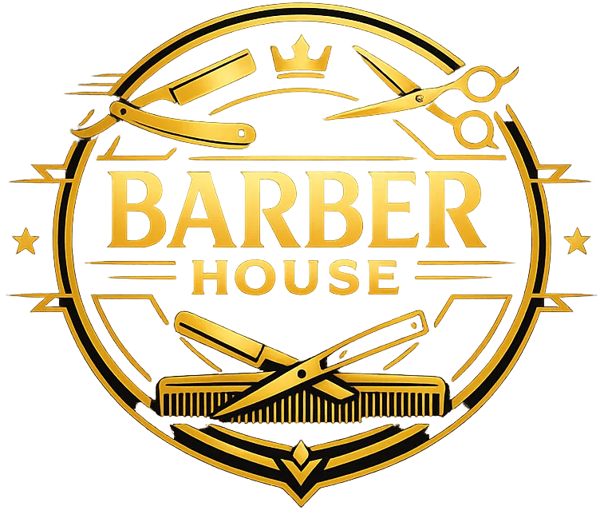

# 💈 Barber House

<div align="center">
  

  **Une expérience de barbier premium** — Site web moderne et performant pour une barbershop haut de gamme.

  [Visiter le site](#) • [Voir le code](#architecture) • [Fonctionnalités](#-fonctionnalités)
</div>

---

## 🎯 À propos

**Barber House** est une vitrine web moderne pour une barbershop premium, construite avec les dernières technologies web. Le site présente une équipe de barbiers professionnels, un catalogue de services, des témoignages clients, et un formulaire de contact élégant.

Ce projet démontre une expertise en développement frontend moderne avec un focus sur l'expérience utilisateur, les performances et le design de qualité.

---

## ✨ Fonctionnalités

### 🎨 Expérience Utilisateur
- **Design Premium** — Interface minimaliste et élégante avec color scheme cohérent
- **Animations Fluides** — Transitions et animations scroll-triggered avec Framer Motion
- **Responsive Design** — Parfaitement optimisé pour tous les appareils (mobile, tablet, desktop)
- **Smooth Scrolling** — Navigation fluide avec ancres intelligentes

### 📱 Sections Principales
- **Hero Section** — Présentation impactante avec CTA
- **À Propos** — Présentation de la barbershop avec pattern vintage
- **Services** — Grille responsive de 6 services premium
- **Équipe** — Profils des 6 barbiers professionnels
- **Témoignages** — Carousel client avec évaluations (⭐)
- **Contact** — Formulaire de prise de contact avec validation
- **Footer** — Design unifié avec le header

### 🚀 Performances
- **Next.js 16** — Framework React moderne avec App Router
- **Image Optimization** — Images optimisées via Next.js Image
- **SSR/SSG** — Rendu optimal pour performances SEO
- **Code Splitting** — Lazy loading automatique des composants

---

## 🛠 Stack Technologique

| Technologie | Version | Usage |
|-------------|---------|-------|
| **Next.js** | 16.1.6 | Framework React, SSR, App Router |
| **React** | 19.2.3 | UI Components & State Management |
| **TypeScript** | 5 | Type-safe Development |
| **Tailwind CSS** | 4 | Utility-first Styling |
| **Framer Motion** | Latest | Scroll Animations |
| **Embla Carousel** | Latest | Carousel Testimonials |
| **Sonner** | Latest | Toast Notifications |
| **shadcn/ui** | Latest | UI Components (Dialog, Input, etc.) |
| **date-fns** | Latest | Date Utilities |
| **Bun** | Latest | Package Manager |

### 🔍 Code Quality
- **ESLint 9** — Linting avec règles Next.js & TypeScript
- **TypeScript Strict Mode** — Type safety renforcée
- **Clean Code** — Principes DRY, composants réutilisables
- **No Hardcoded Colors** — System CSS variables cohérent

---

## 🚀 Installation & Setup

### Prérequis
- **Node.js** >= 18 ou **Bun** >= 1.0
- **Git** pour la gestion de version

### Démarrage Rapide

```bash
# 1. Cloner le repository
git clone https://github.com/yourusername/barber-house.git
cd barber-house

# 2. Installer les dépendances (avec Bun)
bun install

# 3. Lancer le serveur de développement
bun run dev

# 4. Ouvrir dans le navigateur
open http://localhost:3000
```

### Commandes Disponibles

```bash
# Développement
bun run dev          # Démarrer le serveur dev (port 3000)

# Production
bun run build        # Build optimisé
bun run start        # Serveur production

# Qualité du code
bun run lint         # Vérifier ESLint
```

---

## 📁 Architecture du Projet

```
barber-house/
├── app/                          # Next.js App Router
│   ├── page.tsx                 # Page d'accueil
│   ├── layout.tsx               # Layout racine
│   └── globals.css              # Styles globaux
│
├── components/
│   ├── ui/                      # Composants réutilisables
│   │   ├── Button.tsx           # Bouton avec variantes
│   │   ├── Container.tsx        # Wrapper layout
│   │   ├── TeamCard.tsx         # Carte membre équipe
│   │   ├── ServiceCard.tsx      # Carte service
│   │   └── ...shadcn/ui/        # Composants shadcn
│   │
│   └── sections/                # Sections de page
│       ├── Navbar.tsx           # Navigation avec logo
│       ├── Hero.tsx             # Section hero
│       ├── AboutSection.tsx     # À propos
│       ├── ServicesSection.tsx  # Services
│       ├── TeamSection.tsx      # Équipe
│       ├── TestimonialsCarousel.tsx  # Témoignages
│       └── ContactSection.tsx   # Contact
│
├── constants/                   # Données & configuration
│   ├── navigation.ts           # Config navbar
│   ├── services.ts             # Services data
│   ├── team.ts                 # Équipe data
│   ├── testimonials.ts         # Témoignages data
│   └── contact.ts              # Info contact
│
├── types/                      # Définitions TypeScript
│   ├── index.ts               # Exports centralisés
│   ├── service.ts             # Service interface
│   ├── team.ts                # TeamMember interface
│   └── testimonial.ts         # Testimonial interface
│
├── hooks/                      # Hooks personnalisés
│   └── useScrollAnimation.ts  # Animation variants
│
├── lib/                        # Utilitaires
│   └── utils.ts               # Helpers (cn, etc.)
│
└── public/                     # Fichiers statiques
    ├── logo.png               # Logo Barber House
    └── images/
        ├── hero/              # Images hero
        ├── about/             # Images à propos
        ├── team/              # Photos équipe
        └── services/          # Icônes services
```

---

## 🎨 Design & Styling

### Color System
Système de couleurs centralisé avec CSS variables pour une maintenance facile:

```css
/* Brand Colors */
--color-primary: #1a1a1a        /* Noir - Navbar, Footer */
--color-secondary: #d97706      /* Or/Amber - Accents */

/* Semantic Colors */
--color-text-primary: #000000
--color-text-secondary: #6b7280
--color-text-light: #ffffff
--color-bg-primary: #ffffff
--color-bg-secondary: #f9fafb
```

### Typographie
- **Cinzel** — Headings (premium, élégant)
- **Montserrat** — Body text (lisible, moderne)

### Layout Guidelines
- ✅ **Responsive Grid** — Mobile: 1 col, Tablet: 2 cols, Desktop: 3 cols
- ✅ **Spacing** — Cohérent avec Tailwind (py-20, gap-8)
- ✅ **No Border Radius** — Design sharp/moderne
- ✅ **Semantic Colors** — Pas de colors hardcodées

---

## 📸 Screenshots

### Hero Section


### À Propos


### Équipe Professionnelle
| Team 1 | Team 2 | Team 3 |
|--------|--------|--------|
|  |  |  |

| Team 4 | Team 5 | Team 6 |
|--------|--------|--------|
|  |  |  |

---

## 🎯 Fonctionnalités Détaillées

### 🔄 Animations Scroll
- **Fade-In Up Animations** — Éléments apparaissent avec animation au scroll
- **Stagger Effects** — Décalage temporel pour effet cascade
- **Viewport Detection** — Déclenché uniquement quand visible
- **Smooth Scroll** — Navigation fluide vers les sections

**Implémentation:**
```typescript
// Animates on scroll with fade-in effect
<motion.div
  initial={{ opacity: 0, y: 20 }}
  whileInView={{ opacity: 1, y: 0 }}
  transition={{ duration: 0.6 }}
  viewport={{ once: true, margin: "-100px" }}
>
  {/* Content */}
</motion.div>
```

### 📱 Responsive Navigation
- **Desktop** — Menu horizontal avec links
- **Mobile** — Hamburger menu avec smooth slide-down
- **Logo** — Intégration Next.js Image avec dimensions optimales
- **Active Links** — Scroll smooth vers sections avec ancres

### 🎠 Carousel Testimonials
- **Embla Carousel** — Performant et accessible
- **Auto-loop** — Défilement continu
- **Responsive** — S'adapte à tous les écrans
- **Star Ratings** — Affichage des notes ⭐

### 📝 Formulaire Contact
- **Validation** — Email, téléphone, message requis
- **Toast Notifications** — Feedback utilisateur avec Sonner
- **Responsive** — Form gauche, image droite
- **Accessible** — Labels associés, required attributes

---

## 🚀 Performance & SEO

### ⚡ Optimisations
- **Image Optimization** — Next.js Image avec lazy-loading
- **Code Splitting** — Dynamic imports pour composants lourds
- **CSS Purge** — Tailwind produit seulement CSS utilisé
- **Minification** — Build process automatique

### 🔍 SEO
- **Metadata** — Title, description, Open Graph
- **Semantic HTML** — Structure correcte avec `<section>`, `<article>`
- **Alt Text** — Toutes les images avec descriptions
- **Mobile Friendly** — 100% responsive design
- **Performance** — Core Web Vitals optimisés

### 📊 Lighthouse Scores (Target)
- ✅ Performance: 90+
- ✅ Accessibility: 95+
- ✅ Best Practices: 95+
- ✅ SEO: 100

---

## 👨‍💼 À Propos du Développeur

**Barber House** a été développé par [**Zenith**](https://dg-zenith.com) — Web Developer & Freelancer spécialisé en:

- 🎨 **Frontend Modern** — React, Next.js, TypeScript
- 📱 **Responsive Design** — Mobile-first, animations fluides
- ⚡ **Performance** — Core Web Vitals, image optimization
- 🔧 **Clean Code** — TypeScript strict, ESLint, conventions

### 🌐 Portfolio & Contact
- Portfolio: [dg-zenith.com](https://dg-zenith.com)
- Email: [contact@dg-zenith.com](mailto:contact@dg-zenith.com)
- GitHub: [@mehdidiasgomes](https://github.com/mehdidiasgomes)

---

## 📝 License

Ce projet est développé à titre d'exemple/portfolio. Tous droits réservés à Barber House.

---

## 🎓 Apprentissages Clés

Ce projet démontre:

✅ **TypeScript Strict Mode** — Type-safety renforcée, pas de `any`
✅ **Component Architecture** — DRY principles, composants réutilisables
✅ **Animations Modernes** — Framer Motion avec viewport detection
✅ **Responsive Design** — Mobile-first, grid adaptatif
✅ **Performance** — Image optimization, code splitting
✅ **Clean Code** — Conventions de nommage, documentation TSDoc
✅ **Carousel Implementation** — Embla Carousel performant
✅ **Form Validation** — React Hook Form, Zod schemas
✅ **Accessibility** — ARIA labels, semantic HTML
✅ **CSS Variables** — Système de couleurs centralisé

---

<div align="center">

**Construit avec ❤️ par [Zenith](https://dg-zenith.com)**

[Portfolio](#) • [GitHub Repository](#) • [Contact](#)

</div>
